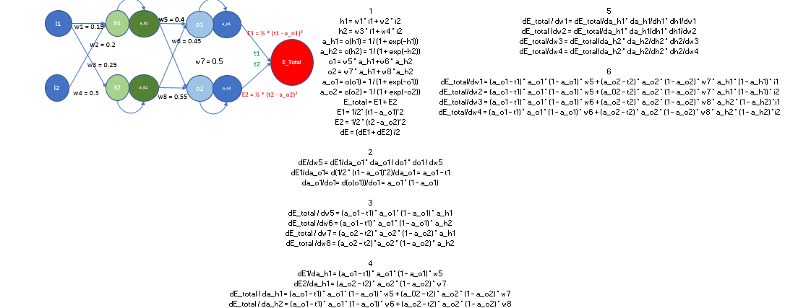
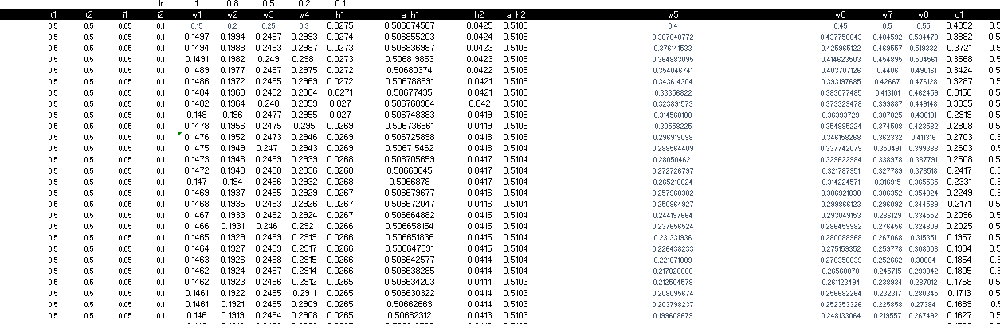
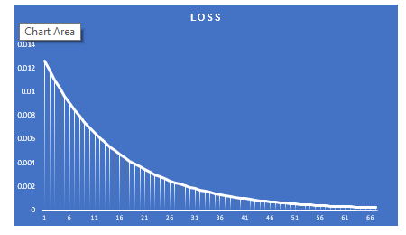
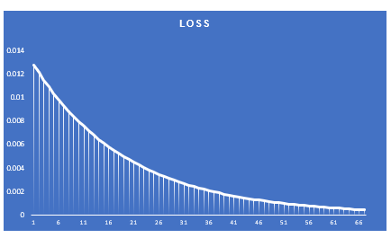
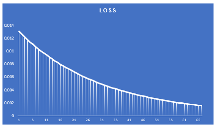

# Backpropagation in Neural Network

The Neural network model considered is the following:-

It is a 2 layered neural network model considered as an example of Backpropagation. Here the model calculates and recalculates the weight based on the backward feedback loop used to adjust the weights to minimize the loss function.

The forward pass is supposed to go through the multiple layers and finally calculate the loss function. 

There is a backward pass where in the weights decay(recalculated) based on the model learning rate and vary them right to the uppermost layer starting from the bottom
The loss function is continuously recalculated until the global loss minima is achieved. Ideally it must be 0

### Values

### The loss function plot lr=1.0

The loss value conversion is quicker compared to the slower learning rate. However, the parameters learnt needs to be seen when we decide on learning rate.

### The loss function plot lr=0.8

It would take much more experiments(epochs) to reach the loss value we reached while using higher learning rate.

### The loss function plot lr=0.5

It takes much more experiments to converge on the least loss function as we got using lr=1.0.